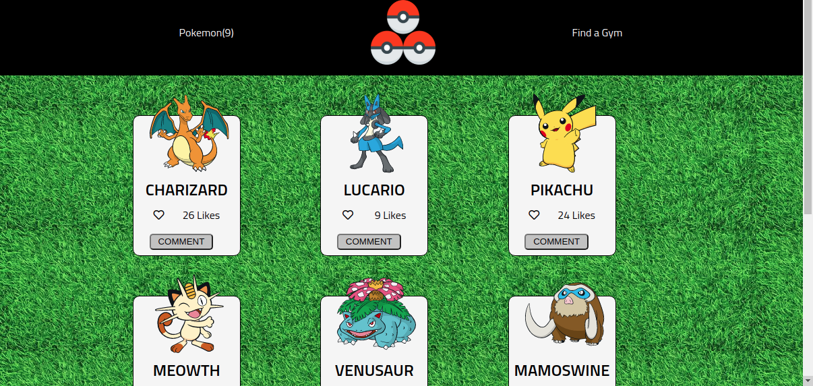

# Pokemon Showcase

> This is an interactive web app that displays Pokemon and allows you to like them.

This is the JavaScript Capstone project.

## There is only one person working on this project, as the other one was removed by Student Success team.
 Student A ( Stephan Annandale ), was resposible for :
- The home page.
- The external API ( PokeAPI ).
- The Involvement API LIKES.
- Testing the item counter
- Styling and dependancies

## Loom Video

[Watch Here!](https://www.loom.com/share/f2c126f0f73342718907c45ccdd3280e)

## Built With

- JavaScript
- Webpack
- HTML & CSS
- Pokemon API (PokeAPI)
- Involvement API

## Live Demo

[Live Demo](https://vigilant-mayer-673e55.netlify.app/)

### Setup

To get a local copy up and running follow these simple example steps.

Click [here](https://github.com/sneeu-leeu/Pokemon-DIsplay) to go to the repo.

Clone the project by opening your terminal and entering "$ git clone" + "The link supplied".

cd into the repo by typing
$ cd ./your-path/Pokemon-DIsplay

$ git checkout development

$ npm install

Open the repo in your code editor and launch it by running '$ npm start' !

## Testing
- run $ npm install --save-dev jest

- followed by '$ npm run test'

## Authors

👤 **Stephan**

Github: @sneeu-leeu

Twitter: @Stephan07484055

Linkedin: Stephan Annandale

## 🤝 Contributing

Contributions, issues, and feature requests are welcome!

Feel free to check the [issues page](https://github.com/sneeu-leeu/To-Do-List/issues/4).

## Show your support

Give a ⭐️ if you like this project!

## 📝 License

This project is [MIT](https://opensource.org/licenses/MIT) licensed.
